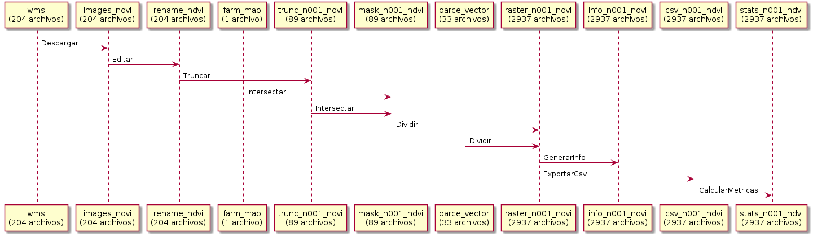

# SpaceAg Quiz Challenge

This a repository of the application I did to the job of "Data Analyst" at
SpaceAg.co.  The purpose of the assignment is to unlock the image data from a
Sentinel Satellite and to be able to depict the behavior of a plant of Avocado
in Ica, Peru. The idea is to be able to analyze yield in terms of an indicator
called NDVI derived from satellite imagery.

The repository contains the code used to process the data and to visualize main
findings in terms of space and time approaches.  In total there are 33 plots
measured along 89 days from mid 2016 to early 2020.  The preprocessing step
contain a bunch of shell scripts that used the Unix tools in order to create
tabular grids which represent each plot per day as a unit of analysis.  The
visualization step contain a bunch of Python scripts that use geopandas to
change the tabular structures into several cubes of data and to create
visualizations for the exploratory analysis.

Each data processing step were executed by a set of scripts following an ETL
like approach. Each step takes files from a folder and creates new files in
another folder and so on. As many steps contain more than 3000 files, the files
were replaced for one text file representing the file lists in each
step/folder.

## Quiz.

Challenge description is in the following link:

[https://bitbucket.org/adoval4/space-ag-data-analyst-challenge/src/master/](https://bitbucket.org/adoval4/space-ag-data-analyst-challenge/src/master/)

## Sentinel images.

Are located in the following folders along with how many of them contains each.

- images_ndvi      : 408 files.
- rename_ndvi      : 204 files.
- trunc_n001_ndvi  : 89 files.
- mask_n001_ndvi   : 89 files.
- parce_vector     : 33 files.
- raster_n001_ndvi : 2937 files.
- info_n001_ndvi   : 2937 files.
- csv_n001_ndvi    : 2937 files.
- stats_n001_ndvi  : 2937 files.

## Workflow.

The following workflow represents the pipeline created to process and visualize
data.

- Descargar: In this step some Jupyter notebooks were used to setup SentinelHub
  API configurations and to test some initial queries.
- Editar: This step contains in one side renaming of the downloaded images,
  because they are downloaded with a filenames that do not represent the
  original date. In the other side, as we generated copies of the original
  images, the resulting ones were edited so as to generate statistics
  immediately and to add compression to them.
- Truncar: It consists of making every pixel below a NDVI cut-off of -0.01 to
  be No Data Value. The purpose is that those pixels should not be included in
  any subsequent calculation.
- Intersectar: This step is required for the images to take only the margins
  that correspond exactly to the original shapefile provided by spaceag team.
- Dividir: This step consists in mixing each 89 image with 1 shapefile which
  has been also recoded so to represent correctly each plot within the orchard.
- Generar Info: This step is useful because allows to check if all images have
  sufficient sample pixels to calculate common statistics. Also because
  querying text files is faster than querying each image with the GeoTiff
  driver.
- Exportar Csv: Csv files were created from GeoTiff images so as to calculate
  fast common statistics to it.
- Calcular Metricas: This step contain common statistics but also median which
  is used, because of the NDVI cut-off chosen for this analysis which is under
  the 0.2 value. So as to not be very biased by lower values of NDVI.
- Extra steps: Rest consisted in aggregating dataframes up to a desired time or
  spatial resolution to create a visualization for analysis. Python scripts
  were used here.

## Csv data.

Either tabular or dataframe (cube) data were located under the csv_datos
folder.  Tabular data were originally in the main path.

## Document.

The resulting document are below the respuesta folder.

## TODO

- The main script needs to be further edited to reflect a more clean command
  line pipeline. Current one is Procesos_temp.sh which contains the pipeline,
  but also contains many temporary commands other than the pipeline itself.
- The path of original input and shapefiles were relocated under the insumos
  folder, so it will be necessary to edit their paths in the corresponding
  scripts in order to process everything with new NDVI cut-offs and so on. Or
  simply to place everything again in the main path in which they were called
  originally.
- Adapt this pipeline to be used in an environment such as
  [Galaxy](https://usegalaxy.org/).
